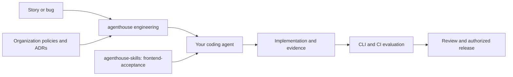

# agenthouse agentic engineering

**Give your coding agent a repeatable path from an idea to a verified, reviewable change.**

agenthouse connects requirements, architecture decisions, implementation, acceptance evidence, and release governance. Developers keep their preferred coding agent; teams keep their repositories, policies, and CI tools. The framework is MIT-licensed and works without a paid account or hosted service.

**0.1.2 developer preview.** The CLI, lifecycle records, policy checks, visual-evidence adapter, versioned frontend skill, and offline updates are implemented. Native agent hooks and marketplace packages are not yet certified. See [implementation status](docs/implementation-status.md).

## Try it in ten minutes

Requires **Node.js 22 or newer**. From a source checkout:

```text
npm ci --ignore-scripts
npm pack
npm install --global ./agenthouse-org-engineering-0.1.2.tgz --ignore-scripts
ah-engineering help
ah-engineering demo --root ./agenthouse-demo
```

If you received the release tarball, start at `npm install --global` using its actual path. No public npm registry release is assumed. Installation from the tarball needs no third-party runtime packages. To avoid a global installation, use `node bin/ah-engineering.js` from this checkout in place of `ah-engineering`.

The demo creates an isolated project and demonstrates:

1. A story: greet a visitor by name.
2. An implementation that fails its acceptance check (**exit 1**).
3. A corrected implementation that passes (**exit 0**).
4. Retained HTML, JSON, and JUnit reports for both runs.

The command prints both HTML report paths. Open them in your browser. Read `story.md`, `greet.mjs`, and `acceptance.mjs` in the demo directory, change the implementation, and rerun:

```text
cd agenthouse-demo
node .agenthouse/run.mjs evaluate --ci --subject demo-your-change
```

The demo is a small CLI acceptance example. It does not approve a release or perform visual acceptance. It requires an empty directory and cannot replace an existing application's configuration.

## Set up your real project

```text
ah-engineering onboard --root /path/to/your/project
```

In a terminal, onboarding asks for your coding agents, an optional organization policy file, and autonomy preference. It installs the project runtime and skills, then prints instructions for your first task. The default is supervised autonomy. Rerunning onboarding on an enrolled project shows its next steps without modifying configuration.

For scripts or a setup without prompts:

```text
ah-engineering onboard --root /path/to/your/project --agents claude,codex,cursor
```

Enterprise teams can add `--policy /path/to/approved-policy.json`. Teams retain ownership of their policies and approval process. Local setup uses a project policy and creates a private signing key under the Git-ignored `.agenthouse/local/` directory.

## Start working

From the enrolled project:

```text
node .agenthouse/run.mjs work new --id first-change --title "Describe the intended outcome"
node .agenthouse/run.mjs work show --id first-change
```

Give your coding agent this prompt:

> Read AGENTS.md and follow the agenthouse lifecycle for first-change. Help me define the outcome and acceptance criteria, then implement and verify it. For UI changes, use the installed frontend-acceptance skill and inspect real screenshots. Report missing evidence and required approvals.

The work record lives in `.agenthouse/work/first-change.json`. Review the criteria and planned checks with your agent. Adapt `.agenthouse/config.json` to your repository's actual test commands; the initial readiness check measures record completeness and is expected to remain incomplete until populated.

After reviewing configuration changes:

```text
node .agenthouse/run.mjs resolve
node .agenthouse/run.mjs evaluate --profile pull-request --ci
```

Evaluation records the clean Git commit by default. For a separately built artifact, supply `--subject` with its actual build identity. Reports appear under `artifacts/agenthouse/`. Passing technical checks and authorized governance decisions remain separate. See [the operating guide](docs/using.md) for evidence fields and signed transitions.

## What gets installed?

npm installs **one executable: `ah-engineering`**. Everything below is a subcommand, not a separate executable.

| Command | Purpose |
| --- | --- |
| `help` / `help COMMAND` | Discover features and command options |
| `onboard` | Guided project setup and next steps |
| `demo` | Run the isolated failure/fix/report example |
| `work new`, `work show`, `work advance` | Track a change through the lifecycle |
| `evaluate` | Run checks locally or in CI |
| `doctor` | Diagnose installation, policy, and skill integrity |
| `resolve`, `session` | Resolve policy and start a session with approved updates |
| `dependencies status`, `pin`, `unpin`, `update` | Inspect and manage the required skill version |
| `init`, `update`, `bundle`, `rollback` | Install, distribute, and update the framework |
| `recover`, `uninstall` | Recover interrupted installation or remove managed assets |
| `module`, `skill` | Explore stack check templates and import additional skills |
| `keygen`, `sign` | Manage keys and sign authorized decisions |

Enrollment creates a project launcher, `node .agenthouse/run.mjs`, which selects the installed runtime. Prefer it for daily work and CI so a global CLI update does not silently change the project's runtime.

Managed assets include `.agenthouse/`, `.agents/skills/`, and instructions appropriate to the selected agents. Installation preserves unrelated content and refuses conflicting edits. It does not install coding agents, browsers, or native hooks.

## How the pieces fit



- **This framework** owns lifecycle records, governance contracts, evaluation, and distribution.
- **agenthouse-skills** owns specialist methods. `frontend-acceptance 0.2.0` is a required, bundled upstream dependency with source commit and hashes. It guides UI acceptance from images, stories, and bugs.
- **agenthouse-hooks** owns native event execution. Its integration remains separate and is not activated by enrollment.

The Playwright adapter captures browser evidence and regression results. Concept review still requires inspection against the intended outcome; unchanged pixels alone do not prove that a design is correct. Browser provisioning is separate. See [visual acceptance](docs/visual-acceptance.md).

## CI, updates, and compatibility

The same `evaluate` command works without an interactive agent. `--ci` freezes policy resolution and never updates dependencies. Exit codes are **0 passed, 1 failed, 2 error, 3 approval pending, 4 incomplete**. Use the supplied [GitHub Actions](templates/ci/github.yml) or [GitLab CI](templates/ci/gitlab.yml) templates and retain reports on failure.

Framework and skill updates use trusted checksums or signatures, project pins, and rollback. Approved local or mirrored bundles can update between sessions; upstream HEAD is never implicitly fetched during evaluation. See [dependency operations](docs/dependencies.md).

Instruction files are generated for Claude Code, Codex, OpenCode, Cursor, Windsurf, and OpenClaw. File generation is tested; native host loading, hooks, and permission behavior still need certification. Windows runtime tests have been run locally; the Linux/macOS CI matrix is supplied. Dedicated external-service connectors and enterprise live pilots remain open.

## Learn more and contribute

- [Operating guide](docs/using.md) and [lifecycle stages](docs/lifecycle.md)
- [Implementation status](docs/implementation-status.md) and [delivery roadmap](docs/delivery-plan.md)
- [Architecture](docs/blueprint.md), [governance](docs/governance.md), and [decision records](docs/adr/README.md)
- [Distribution](docs/distribution.md), [integrations](docs/integrations.md), and [migration](docs/migration.md)

To validate changes from a checkout:

```text
npm test
npm run check
npm run test:browser
```

Browser verification requires Playwright Chromium or `AH_BROWSER_EXECUTABLE` pointing to installed Chrome/Chromium. Private reference material under `input/` is excluded from Git and release artifacts.

New framework content uses the [MIT License](LICENSE). Imported skills retain upstream attribution and license declarations.

[agenthouse.org](https://agenthouse.org)
