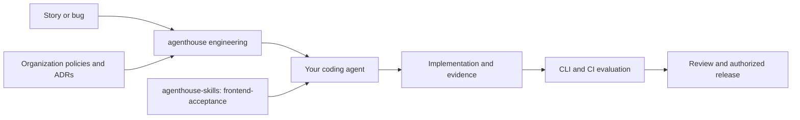

# agenthouse agentic engineering

**Give your coding agent a repeatable path from an idea to a verified, reviewable change.**

agenthouse connects requirements, architecture decisions, implementation, acceptance evidence, and release governance. Developers keep their preferred coding agent; teams keep their repositories, policies, and CI tools. The framework is MIT-licensed and works without a paid account or hosted service.

**0.1.4 developer preview.** The CLI, lifecycle records, policy checks, visual-evidence adapter, versioned frontend skill, and offline updates are implemented. Repository survey, structured ready/done gates, red/green capture, hooks, usability tooling and marketplace manifests are included. See [implementation status](docs/implementation-status.md).


## Install on your computer

Requires **Node.js 22 or newer**. Install the CLI once, then enroll each existing application repository. You do not need to run `npm ci` in your application to adopt agenthouse.

### Planned npm installation — publication pending

The intended installation after npm publication is:

```text
# Available after the package is published to npm:
npm install --global @agenthouse-org/engineering --ignore-scripts
ah-engineering onboard --root "C:/src/my-existing-app"
```

**The 0.1.4 preview has not been published to npm; this registry installation is not yet available.** Versioned GitHub release downloads are also pending. Once published, those downloads will provide a manual, enterprise and offline installation option without cloning or building the framework.

### Install a supplied package

If your team or a maintainer has supplied the `.tgz` package, run this from the directory containing it:

```text
npm install --global ./agenthouse-org-engineering-0.1.4.tgz --ignore-scripts
ah-engineering onboard --root "C:/src/my-existing-app"
```

Replace the example repository path with your application's actual location. The core package has no third-party runtime dependencies. Global CLI installation does not replace the application's `node_modules`, change its dependencies or change its Git remote. Onboarding adds framework assets and managed instruction sections, preserves consumer configuration, and reports conflicting managed files.

### Current public preview: install from a separate checkout

Until public package downloads are available, another user can obtain the preview from GitHub. Run these commands in a tools directory outside the application repository; Git is required:

```text
git clone https://github.com/agenthouse-org/agentic-engineering.git agenthouse-engineering
cd agenthouse-engineering
npm pack --ignore-scripts
npm install --global ./agenthouse-org-engineering-0.1.4.tgz --ignore-scripts
ah-engineering onboard --root "C:/src/my-existing-app"
```

Use the filename printed by `npm pack` if the preview version has changed. This packages the checked-in runtime and generated assets without installing development dependencies. Alternatively, skip packaging and global installation: use `node bin/ah-engineering.js` from this checkout wherever the instructions below use `ah-engineering`.

## Try it in ten minutes

With the CLI installed, run:

```text
ah-engineering help
ah-engineering demo --root ./ah-demo
```

The demo creates an isolated project and demonstrates:

1. A story: greet a visitor by name.
2. An implementation that fails its acceptance check (**exit 1**).
3. A corrected implementation that passes (**exit 0**).
4. Retained HTML, JSON, and JUnit reports for both runs.

The command prints both HTML report paths. Open them in your browser. Read `story.md`, `greet.mjs`, and `acceptance.mjs` in the demo directory, change the implementation, and rerun:

```text
cd ah-demo
node .agenthouse/run.mjs evaluate --ci --subject demo-your-change
```

The demo is a small CLI acceptance example. It does not approve a release or perform visual acceptance. It requires an empty directory and cannot replace an existing application's configuration.

## Set up your real project

```text
ah-engineering onboard --root /path/to/your/project
```

In a terminal, onboarding asks for your coding agents, an optional organization policy file, and autonomy preference. It installs the project runtime and skills, then prints instructions for your first task. The default is supervised autonomy. Rerunning onboarding on an enrolled project shows its next steps without modifying configuration.

For scripts or a setup without prompts:

```text
ah-engineering onboard --root /path/to/your/project --agents claude,codex,cursor
```

Enterprise teams can add `--policy /path/to/approved-policy.json`. Teams retain ownership of their policies and approval process. Local setup uses a project policy and creates a private signing key under the Git-ignored `.agenthouse/local/` directory.

## Agent commands

Every CLI operation is also available as an `ah-` agent skill. Try `/ah-help`, `/ah-onboard`, or `/ah-review-change` in hosts with slash commands; in Codex select the named skill or use `$ah-help`. Project enrollment installs the appropriate entry points.

Story drafting, readiness, scope validation, commit checking, and review workflows are included. See [all agent commands and host-specific usage](docs/agent-commands.md). CLI-only global installation does not register project commands before enrollment.

### Included skills

The framework ships **38 agent-facing skills**, plus pinned upstream **frontend-acceptance 0.2.0** and **web-usability-conformity 0.1.0** skills.

| Skill | Purpose |
| --- | --- |
| `ah-help` | Discover commands and features |
| `ah-onboard` | Guided project setup |
| `ah-enroll-repository` | Enroll an existing repository |
| `ah-init` | Install framework assets |
| `ah-demo` | Run the failure/fix example |
| `ah-lifecycle` | Guide work through the SDLC |
| `ah-work` | Create, inspect, and advance work records |
| `ah-draft-user-story` | Draft outcomes and acceptance criteria |
| `ah-assess-story-readiness` | Assess whether work is ready to implement |
| `ah-validate-scope` | Check scope against the intended outcome |
| `ah-check-commit` | Verify behavior affected by a commit |
| `ah-review-change` | Review requirements, changes, and evidence |
| `ah-frontend-acceptance` | Invoke the pinned upstream frontend skill |
| `ah-web-usability-conformity` | Invoke the pinned upstream usability skill |
| `ah-controls` | Map rules to actual checks and guidance |
| `ah-survey` | Discover repository tooling and conventions |
| `ah-inspect` | Analyze a commit or range |
| `ah-review` | Map criteria to build and policy evidence |
| `ah-gate` | Evaluate ready/done rules and decisions |
| `ah-spec` | Capture unchanged-test red/green evidence |
| `ah-backlog` | Import markdown or exported work items |
| `ah-usability` | Provision and run the upstream browser audit |
| `ah-hook` | Process local engineering events |
| `ah-hook-config` | Discover native hook configuration |
| `ah-evaluate` | Run configured checks and produce reports |
| `ah-doctor` | Diagnose installation and dependency problems |
| `ah-resolve` | Resolve or verify policy configuration |
| `ah-session` | Start a session and process approved updates |
| `ah-dependencies` | Inspect, pin, unpin, and update dependencies |
| `ah-update` | Update the framework |
| `ah-bundle` | Create an offline distribution bundle |
| `ah-rollback` | Restore the previous version set |
| `ah-recover` | Recover an interrupted installation |
| `ah-uninstall` | Remove managed framework assets |
| `ah-skill` | Import another reviewed skill |
| `ah-module` | Explore stack-specific check templates |
| `ah-keygen` | Generate signing keys |
| `ah-sign` | Sign authorized decisions or bundles |

`ah-frontend-acceptance` routes to `frontend-acceptance`, installed unchanged from agenthouse-skills. `web-usability-conformity` is bundled from the same upstream. Run `usability setup` to provision its locked browser tooling, then `usability run` to collect evidence. Skill invocation does not bypass project governance or host permissions.

Existing projects can install these entry points by rerunning `init` from the new package with their chosen agents. Unchanged old managed command names are removed; edited files cause a conflict instead of being overwritten. Reload the host if its command menu has not refreshed.

## Inspect, verify and review

Start with `survey` to discover the actual tooling, then `inspect --ref HEAD --base main` to identify the affected code. Import a story with `backlog`, define observable criteria, and use `spec` when red/green test evidence fits the change. Configurable `gate` checks protect readiness and completion; `review` maps evidence to requirements and can compare a baseline report. Teams can choose shorter lifecycle paths while retaining protected decisions.

See [workflow commands](docs/workflow-tools.md), [engineering hooks](docs/hooks.md), and [marketplace installation](docs/marketplaces.md). The [Node/TypeScript](modules/node-typescript.md) and [PHP/Laravel](modules/php-laravel.md) modules include practical standards and touched-file check templates.

## Start working

From the enrolled project:

```text
node .agenthouse/run.mjs work new --id first-change --title "Describe the intended outcome"
node .agenthouse/run.mjs work show --id first-change
```

Give your coding agent this prompt:

> Read AGENTS.md and follow the agenthouse lifecycle for first-change. Help me define the outcome and acceptance criteria, then implement and verify it. For UI changes, use the installed frontend-acceptance skill and inspect real screenshots. Report missing evidence and required approvals.

The work record lives in `.agenthouse/work/first-change.json`. Review the criteria and planned checks with your agent. Adapt `.agenthouse/config.json` to your repository's actual test commands; the initial readiness check measures record completeness and is expected to remain incomplete until populated.

After reviewing configuration changes:

```text
node .agenthouse/run.mjs resolve
node .agenthouse/run.mjs evaluate --profile pull-request --ci
```

Evaluation records the clean Git commit by default. For a separately built artifact, supply `--subject` with its actual build identity. Reports appear under `artifacts/agenthouse/`. Passing technical checks and authorized governance decisions remain separate. See [the operating guide](docs/using.md) for evidence fields and signed transitions.

## What gets installed?

npm installs **one executable: `ah-engineering`**. Everything below is a subcommand, not a separate executable.

| Command | Purpose |
| --- | --- |
| `help` / `help COMMAND` | Discover features and command options |
| `onboard` | Guided project setup and next steps |
| `demo` | Run the isolated failure/fix/report example |
| `work new`, `work show`, `work advance` | Track a change through the lifecycle |
| `evaluate` | Run checks locally or in CI |
| `doctor` | Diagnose installation, policy, and skill integrity |
| `resolve`, `session` | Resolve policy and start a session with approved updates |
| `dependencies status`, `pin`, `unpin`, `update` | Inspect and manage the required skill version |
| `init`, `update`, `bundle`, `rollback` | Install, distribute, and update the framework |
| `recover`, `uninstall` | Recover interrupted installation or remove managed assets |
| `module`, `skill` | Explore stack check templates and import additional skills |
| `keygen`, `sign` | Manage keys and sign authorized decisions |

Enrollment creates a project launcher, `node .agenthouse/run.mjs`, which selects the installed runtime. Prefer it for daily work and CI so a global CLI update does not silently change the project's runtime.

Managed assets include `.agenthouse/`, `.agents/skills/`, and instructions appropriate to the selected agents. Installation preserves unrelated content and refuses conflicting edits. It does not install coding agents, browsers, or native hooks.

## How the pieces fit



- **This framework** owns lifecycle records, governance contracts, evaluation, and distribution.
- **agenthouse-skills** owns specialist methods. `frontend-acceptance 0.2.0` is a required, bundled upstream dependency with source commit and hashes. It guides UI acceptance from images, stories, and bugs.
- **agenthouse-hooks** owns native event execution. The framework bundles a content-pinned engineering event export; native hooks are activated explicitly.

The Playwright adapter captures browser evidence and regression results. Concept review still requires inspection against the intended outcome; unchanged pixels alone do not prove that a design is correct. Browser provisioning is separate. See [visual acceptance](docs/visual-acceptance.md).

## CI, updates, and compatibility

The same `evaluate` command works without an interactive agent. `--ci` freezes policy resolution and never updates dependencies. Exit codes are **0 passed, 1 failed, 2 error, 3 approval pending, 4 incomplete**. Use the supplied [GitHub Actions](templates/ci/github.yml) or [GitLab CI](templates/ci/gitlab.yml) templates and retain reports on failure.

Framework and skill updates use trusted checksums or signatures, project pins, and rollback. Approved local or mirrored bundles can update between sessions; upstream HEAD is never implicitly fetched during evaluation. See [dependency operations](docs/dependencies.md).

Instruction files are generated for Claude Code, Codex, OpenCode, Cursor, Windsurf, and OpenClaw. Claude and Codex packed-plugin installation and enablement were exercised in isolated native CLI profiles. Live-session hook delivery and all-host discovery/permission behavior still require environment-specific validation. Core verification has passed in GitHub Actions on Windows, Linux, and macOS, along with the Linux browser test. Dedicated external-service connectors and enterprise live pilots remain open.

## Learn more and contribute

- [Operating guide](docs/using.md) and [lifecycle stages](docs/lifecycle.md)
- [Implementation status](docs/implementation-status.md) and [delivery roadmap](docs/delivery-plan.md)
- [Architecture](docs/blueprint.md), [governance](docs/governance.md), and [decision records](docs/adr/README.md)
- [Distribution](docs/distribution.md), [integrations](docs/integrations.md), and [migration](docs/migration.md)

To validate changes from a checkout:

```text
npm ci --ignore-scripts
npm test
npm run check
npm run test:browser
```

Run these development commands inside the framework checkout. `npm ci` removes and reinstalls that checkout's `node_modules` from its lockfile; `--ignore-scripts` skips installation scripts, not dependency cleanup. It does not remove source files or Git history. This step is for framework development and testing, not application enrollment.

Browser verification requires Playwright Chromium or `AH_BROWSER_EXECUTABLE` pointing to installed Chrome/Chromium. Private reference material under `input/` is excluded from Git and release artifacts.

New framework content uses the [MIT License](LICENSE). Imported skills retain upstream attribution and license declarations.

[agenthouse.org](https://agenthouse.org)
